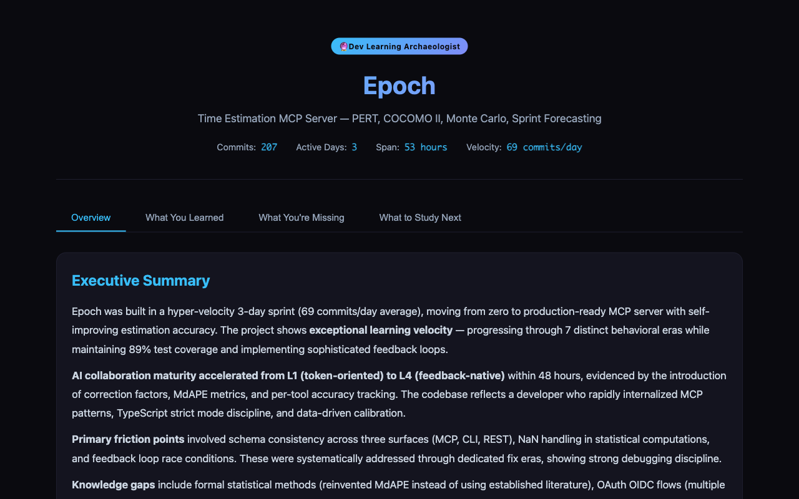

# Dev Learning Archaeologist

> **Drop this folder into any project, open your AI coding assistant, and get a full forensic learning diagnostic in 60 seconds.**

<p align="center">
  
  
  
  
  
  
</p>

<p align="center">
  
</p>

<p align="center"><em>Actual report generated from a public repo — 207 commits, 3 days, 7 behavioral eras detected. Every chart cites real commit hashes.</em></p>

**Dev Learning Archaeologist** is a forensic analysis tool that reads a project's git history to provide developers with an objective, evidence-backed assessment of their learning progress, knowledge gaps, and recommended study paths. Every claim is tied to a specific commit hash from the analyzed repository.

You know that feeling when you've been coding for months and can't tell if you're actually getting better?

**This tool reads your git history and tells you exactly what you learned, what you're missing, and what to study next.** No setup. No data entry. No subjective guesses.

---

## What is this?

Dev Learning Archaeologist is a Node.js-based diagnostic tool designed for **technical users and developers**. It performs a 5-phase forensic analysis on a Git repository's commit history to generate a self-contained HTML report. The report answers three core questions:
1.  **What have you learned?** (Progress and velocity)
2.  **What are you missing?** (Knowledge gaps and friction points)
3.  **What should you study next?** (A personalized, evidence-based curriculum)

It is built on the [Interpretable Context Methodology (ICM)](https://arxiv.org/abs/2603.16021), where folder structure functions as agent architecture.

---

## Features

-   **Evidence-Based Insights**: Every metric, finding, and recommendation is traced back to specific commit hashes (`e.g., 2db9a3e`).
-   **Zero-Dependency Analysis**: Works with **git history alone**. No external databases or services are required.
-   **Auto-Generated Visual Report**: Outputs a single, self-contained HTML file that auto-opens in the browser with **8 interactive charts** (era timelines, velocity curves, heatmaps, etc.).
-   **Multi-Phase Forensic Pipeline**: A structured 5-phase process ensures reproducible and thorough analysis.
-   **7 Parallel Analysis Vectors**: Uncover learning velocity, frustration patterns, AI collaboration maturity, knowledge gaps, temporal behavior, cross-domain skill transfer, and external learning correlation.
-   **Modern CI/CD**: Includes a GitHub Actions workflow for continuous integration and automated testing.
-   **Automated Dependency Management**: Configured with Renovate to keep dependencies current.

---

## Installation

**Prerequisites:**
-   **Node.js** ≥ 22 (Tested with Node 26 via Docker)
-   **Git** must be installed and available in your PATH.
-   An **AI coding assistant** like [Claude Code](https://docs.anthropic.com/en/docs/claude-code), [Cursor](https://cursor.sh/), or GitHub Copilot Chat.

**Steps:**
1.  Clone this repository:
    ```bash
    git clone https://github.com/KyaniteLabs/dev-learning-archaeologist.git
    ```
2.  (Optional) For development, install dependencies:
    ```bash
    cd dev-learning-archaeologist
    npm install
    ```

---

## Quick Start

**For a one-off analysis on any project:**

1.  Copy the entire `dev-learning-archaeologist` folder into the root of your target project.
    ```bash
    cp -r dev-learning-archaeologist /path/to/your-project/
    ```
2.  Open your AI coding assistant (e.g., Claude Code) in your project's root directory.
    ```bash
    cd /path/to/your-project && claude
    ```
3.  Paste the following prompt:
    ```
    Analyze this repository's git history using the Dev Learning Archaeologist
    methodology. Start with Phase 0 (ground truth), then proceed through all 5 phases.
    ```

**That's it.** The assistant will follow the rules and pipeline defined in `rules.md`, run the analysis, and open the final HTML report in your browser.

---

## Usage

### Basic Workflow
The tool is designed to be run by an AI agent within a conversation. You don't execute a script directly; you guide your AI assistant to use the tool's methodology.

1.  **Context Setup**: Ensure the `dev-learning-archaeologist` folder is present in your project directory.
2.  **Prompt Your Assistant**: Use a prompt similar to the one in the Quick Start. The assistant will read `identity.md` to understand its role and `rules.md` to execute the pipeline.
3.  **Review the Report**: Upon completion, an HTML file (e.g., `dev-learning-report.html`) will be generated and auto-opened. It contains the full narrative, visualizations, and data tables.

### Advanced & Optional Enrichment
The base analysis uses only Git history. For richer insights, you can provide additional data sources:

| Data Source | Where to Place It | What It Unlocks |
| :--- | :--- | :--- |
| **AI Session Logs** | `.claude/`, `.cursor/`, or Copilot exports in the project root. | AI Collaboration Maturity scoring (autonomy level, trust trajectory). |
| **Cross-Repo History** | Point the analysis to other local repositories you own. | Cross-Domain Transfer vector analysis. |
| **YouTube History** | `data/` folder (Google Takeout JSON export). | External Learning vector (correlating watch history with commit activity). |

### Data Privacy & Security
-   **All analysis is local**: The tool runs entirely on your machine. No commit data is sent to external servers.
-   **No mandatory sign-ups**: It works out-of-the-box without any accounts or API keys.
-   **Sensitive data**: Be cautious when analyzing repositories containing sensitive information, as the report will include file paths and commit messages.

---

## How It Works

The archaeologist runs a **5-phase forensic pipeline**:

1.  **Phase 0: Ground Truth** — Count commits, consolidate identities, establish baseline metrics.
2.  **Phase 1: Excavate** — Extract commit types, temporal patterns, burst-gap cycles, file hotspots.
3.  **Phase 2: Stratify** — Detect behavioral eras by velocity shifts, intent changes, and technology adoption.
4.  **Phase 3: Analyze** — Run 7 independent analysis vectors in parallel.
5.  **Phase 4: Deliver** — Generate a self-contained HTML report and open it in the browser.

### The 7 Analysis Vectors

| # | Vector | What It Finds |
|---|--------|--------------|
| 1 | **Learning Velocity** | How fast you're learning new concepts, and whether it's accelerating. |
| 2 | **Frustration Detection** | Files you keep revisiting, fix clusters, where you're stuck (not just iterating). |
| 3 | **AI Collaboration Maturity** | Your autonomy level (L1 Directed → L4 Supervisory) and trust trajectory. |
| 4 | **Knowledge Gaps** | Reinvented wheels, missing fundamentals, and what's causing rework. |
| 5 | **Temporal Behavior** | Peak creative hour, optimal work patterns, burst sustainability. |
| 6 | **Cross-Domain Transfer** | Skills from non-coding domains showing up in your code. |
| 7 | **External Learning** | YouTube watch history → commit correlation (with Google Takeout). |

---

## Built On ICM

This is an [Interpretable Context Methodology](https://arxiv.org/abs/2603.16021) specialist — folder structure as agent architecture. Each file has one job:

| File | Job |
|------|-----|
| `identity.md` | Who the specialist is — loads first. |
| `rules.md` | The 5-phase pipeline, 7 vectors, output constraints. |
| `examples.md` | Conversational demos showing the specialist in action. |
| `reference/` | Detailed schemas, heuristics, and specs for the analysis. |
| `tests/` | Node.js test suite for validating core functionality. |

---

## FAQ

**Q: How accurate is this? Are the findings just guesses?**
A: The findings are evidence-based. Every observation (e.g., "frustration detected in file X") is tied to one or more specific commit hashes from your repository. You can inspect the cited commits (`e.g., b3b68c4`) to verify the pattern. The tool detects *patterns* in your behavior, not subjective opinions.

**Q: What if I use AI tools like Cursor, GitHub Copilot, or others besides Claude Code?**
A: The tool is compatible with any AI coding assistant capable of reading the repository's files and following instructions. The recent `202d8ef` commit specifically enhanced compatibility with models like GLM-4.5-Air. You provide the context; your chosen AI executes the methodology.

**Q: Is my code and data safe? Is it sent to the cloud?**
A: Yes, it's safe. The entire analysis runs locally on your machine using your local Git history and Node.js. No code, commit messages, or data are transmitted to any external service. The output is a local HTML file.

**Q: Does this require a massive repo with thousands of commits to be useful?**
A: No. While more history provides richer trend analysis, the tool can work with smaller repositories (50-100 commits). It will detect available patterns and provide insights proportional to the available data, noting when evidence is limited.

**Q: Can I use this on a private or work-related repository?**
A: Absolutely. Since all processing is local, it's safe for use on private repositories. However, be mindful of generating and sharing the final HTML report if the repository's commit messages contain confidential information.

---

## Contributing

We welcome contributions! Here's how to get started:

1.  **Fork** the repository and clone it locally.
2.  **Install development dependencies**:
    ```bash
    npm install
    ```
3.  **Run the test suite** to ensure everything is working:
    ```bash
    npm test
    ```
4.  **Create a feature branch** for your changes.
5.  **Commit your changes** with clear, descriptive messages.
6.  **Push** to your fork and **open a Pull Request** against the `main` branch.

Please ensure your code passes all existing tests and consider adding tests for new functionality. Refer to `CONTRIBUTING.md` for detailed guidelines.

---

## Going Further

This repository is the lightweight diagnostic: zero install, runs in an AI coding conversation, and produces an evidence-backed learning report from a project's git history.

For the installable, CLI-driven archaeology pipeline with SQLite databases, Datasette inspection, multi-project sync, audits, and 20+ commands, use [DevArch Framework](https://github.com/KyaniteLabs/devarch-framework).

| | Learning Archaeologist | DevArch Framework |
|---|---|---|
| **Setup** | Drop in a folder | `pip install` |
| **Runs in** | AI assistant conversation | CLI / Python API |
| **Vectors** | 7 learning-focused | 6 + 14 opportunity analyzers |
| **Output** | HTML report | HTML + SQLite + Datasette + Markdown |
| **Best for** | "How am I doing?" | "Archaeologically analyze everything" |

---

## License

This project is licensed under the **MIT License**. See the [LICENSE](LICENSE) file for details.

---

## Part of KyaniteLabs

Made by [Simon Gonzalez de Cruz](https://github.com/Pastorsimon1798) — [KyaniteLabs](https://github.com/KyaniteLabs). We build AI-native developer tools.

More from **[KyaniteLabs](https://kyanitelabs.tech)**. Related projects:

- **[devarch-framework](https://github.com/KyaniteLabs/devarch-framework)** — Git-repository archaeology framework
- **[checkyourself](https://github.com/KyaniteLabs/checkyourself)** — Local-first production-readiness checks for AI-built code
- **[Elixis](https://github.com/KyaniteLabs/Elixis)** — Local-first AI pattern-synthesis engine for ideas

→ More at **[kyanitelabs.tech](https://kyanitelabs.tech)**